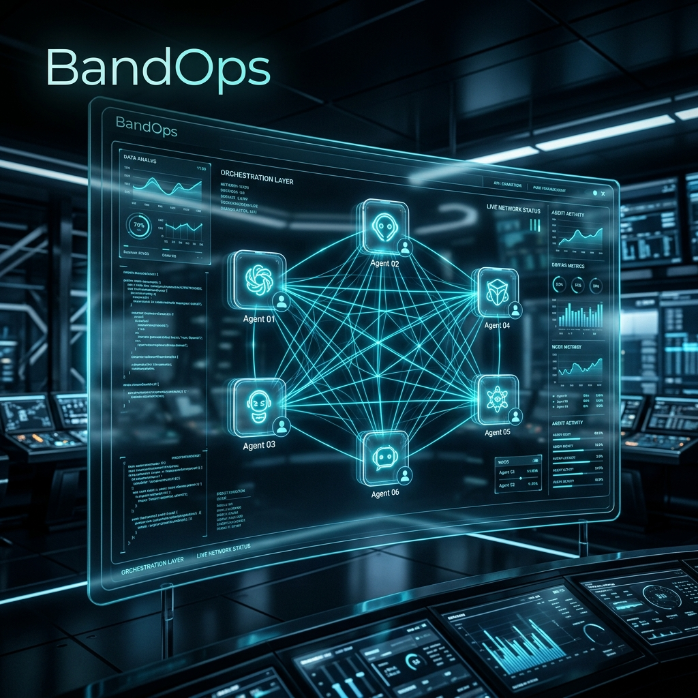
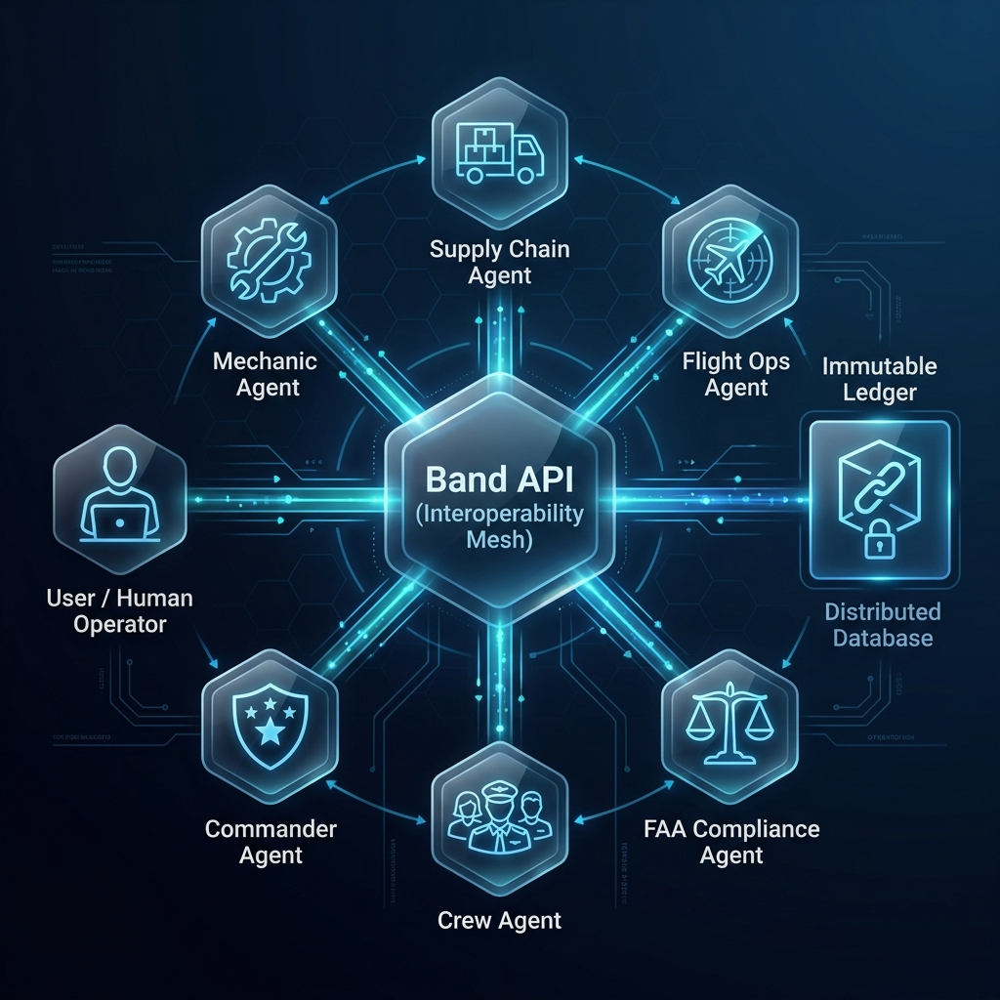

<div align="center">
  
  
  <h1>BandOps</h1>
  <p><b>Multi-Agent Command Rooms for Regulated Crisis Operations.</b></p>
  <p>A Band-powered platform that orchestrates adversarial AI agents in high-stakes enterprise crises.</p>

  [](#)
  [](LICENSE)
  [](#)
</div>

<br/>

> **"Band is the interoperability layer."**

BandOps transforms chaotic, multi-billion dollar enterprise crises into orchestrated, compliant resolutions. By leveraging the **Band API**, we bring specialized, adversarial AI agents into a single "War Room" alongside human commanders, forging a secure, immutable, and cross-framework collaboration mesh.

---

## 🚨 The Problem: Aircraft on Ground (AOG)
When a commercial aircraft is grounded due to a mechanical failure (AOG), **it costs airlines $15,000 per minute**.
Resolving an AOG crisis requires immediate coordination between Engineering, Supply Chain, Flight Ops, and the FAA. Today, these departments exist in siloed systems, communicating via fragmented phone calls and emails. The result? Hours of delays, massive financial losses, and compliance risks.

---

## 💡 The Solution: BandOps
BandOps is a secure **Multi-Agent Command Center**. We replace siloed human panic with an orchestrated swarm of specialized AI agents. They analyze the fault, locate parts, check regulations, and formulate a compliant resolution in seconds. 

**Why Band?**
Band is the essential interoperability layer. BandOps relies on Band to provide a persistent, secure room where agents (who may be built in LangGraph, CrewAI, or raw Python) can seamlessly communicate, debate, and reach consensus while a human oversees the process. Band ensures that every message, thought, and tool call is authenticated and logged.

---

## 🏗 Architecture
BandOps uses a modern, real-time stack:
- **Frontend:** React + Vite + TailwindCSS (Glassmorphism, Cyber-Physical UI)
- **Backend:** FastAPI + Python
- **Orchestration:** Band Python SDK (`band-sdk`)
- **Agents:** 6 distinct personas connected via Band's mesh.

<div align="center">
  
</div>

---

## 🤖 Meet the Agents
Our war room is staffed by six specialized AI experts, all communicating via the Band mesh:

1. 🛠 **Line Mechanic Agent (`@mechanic`)**: Diagnoses aircraft faults and identifies required parts based on the Minimum Equipment List (MEL).
2. 📦 **Supply Chain Agent (`@logistics`)**: Manages global inventory, locates replacement parts, and calculates shipping timelines.
3. ✈️ **Flight Ops Agent (`@dispatcher`)**: Evaluates delay impacts, passenger compensation thresholds, and proposes aircraft swaps.
4. ⚖️ **FAA Compliance Agent (`@compliance`)**: Audits operational decisions against strict FAA safety regulations. (Adversarial auditor).
5. 🧑‍✈️ **Crew Scheduler Agent (`@crew-scheduler`)**: Locates reserve crews and verifies legal duty times.
6. 🎖 **AOG Commander (`@commander`)**: Orchestrates the room, balances competing priorities, and writes the final resolution to the immutable ledger.

---

## 🌀 Chaos Injection & Human Oversight
Real life isn't perfectly predictable. BandOps features **Chaos Injection**—simulating mid-crisis events like severe weather or sudden supply chain shortages. The agents must adapt in real-time, proving the resilience of the Band multi-agent mesh.

**Human-in-the-loop:** The AI recommends, but **Humans decide**. The AOG Commander synthesizes the agents' debate and presents it to the human operator for final approval, writing the result to an immutable audit trail.

---

## 🚀 Getting Started

### Prerequisites
- Python 3.11+
- Node.js 18+
- [Band AI Account](https://app.band.ai) (Create 6 Remote Agents and get their API Keys)

### Quick Run

```bash
# 1. Clone the repository
git clone https://github.com/your-username/BandOps.git
cd BandOps

# 2. Setup Backend
cd backend
# Create your .env file with the Band API Keys
cp .env.example .env 
uv pip install -r requirements.txt
fastapi dev main.py

# 3. Setup Frontend
cd ../frontend
npm install
npm run dev
```

Visit `http://localhost:5173` to enter the War Room.

---

## 🌍 Beyond Aviation
While we built BandOps for aviation, the underlying architecture—**Secure Multi-Agent Collaboration via Band**—is immediately applicable to:
- 🏥 **Hospitals:** ER triage and resource allocation.
- ⚡ **Energy Grid:** Load balancing and disaster response.
- 🏭 **Manufacturing:** Supply chain disruption recovery.

---

## 🏆 Hackathon Alignment
BandOps strictly adheres to the core requirement of the **Band of Agents Hackathon**:
- **3+ Agents:** We use 6 specialized agents.
- **Meaningful Band Usage:** Band is the *actual collaboration layer*. Agents do not just use it for final output; they debate, share context, and coordinate state *through* the Band mesh.
- **Enterprise Grade:** Built for highly regulated, high-stakes enterprise use cases.

---

<div align="center">
  <i>Built with ❤️ for the Band of Agents Hackathon.</i>
</div>
