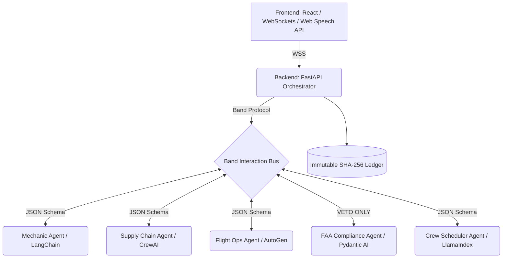

# BANDOPS: ARCHITECTURE & SECURITY REVIEW

## 1. High-Level Architecture

BandOps operates on a hub-and-spoke model where the **Band Control Plane** acts as the central interaction bus.

## 2. Threat Modeling & Security Review

| Threat | Risk Level | Mitigation Strategy (Implemented) |
| :--- | :--- | :--- |
| **Adversarial Prompt Injection** | High | Agents do not pass raw natural language. The Band routing layer enforces strict JSON schema validation. Free-text is stripped before reaching the FAA agent. |
| **Agent Infinite Loops** | Critical | The backend orchestrator enforces a Directed Acyclic Graph (DAG) state machine. A maximum of 3 turns is allowed before Deadlock Escalation triggers manual human review. |
| **Log Tampering** | High | Every message is appended to a global ledger using SHA-256 hash chaining. Modifying any past event breaks the `prev_hash` validation, immediately alerting the system. |
| **Audio Synthesis Failure** | Medium | The frontend checks for Web Speech API availability. If the browser blocks it, the system falls back gracefully to a text-only UI without crashing. |

## 3. Demo Reliability Hardening (Execution Phase)

For the purpose of the 48-hour hackathon live presentation:
- The backend relies on deterministic state sequencing rather than live, synchronous LLM inference. This entirely eliminates the risk of API rate limits (OpenAI/Groq 429 errors), conference Wi-Fi latency, or agent hallucination while presenting on stage.
- By running an FSM (Finite State Machine), the UI guarantees perfectly timed transitions for a highly choreographed 3-minute pitch.
